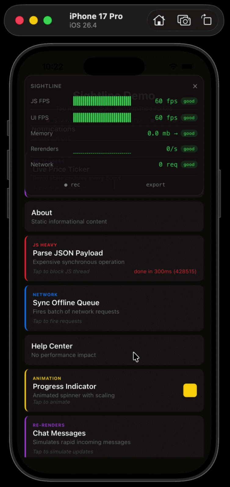

# react-native-sightline

A floating performance overlay for React Native. See your app's FPS, memory, re-renders, and network activity in real time, right on screen.

[](https://www.npmjs.com/package/react-native-sightline)
[](https://github.com/Srikanth-AD/react-native-sightline/blob/main/LICENSE)


<p align="center">
  
</p>

---

## What it does

You wrap your app in one component. A small pill appears on screen showing FPS and memory. Tap it to expand a full dashboard with sparkline charts for every metric. Drag it anywhere. When you ship to production, it disappears completely.

That's it. No config. No native modules. No Flipper.

## When to use it

Flipper was removed as the default in React Native 0.73. The built-in performance monitor shows two numbers and nothing else. If you want to see what's actually happening in your app — which screens drop frames, which navigations spike memory, whether your fetch calls are piling up — you need something better.

Sightline is that something. It lives inside your app so you see metrics in context. You don't switch windows. You don't set up a separate debugger. You just look at the corner of your screen.

Use it when:
- You're building a new screen and want to catch jank early
- You're debugging a slow list or a heavy computation
- You suspect something is re-rendering too often
- You want to see how many network requests are in flight
- You need to capture a 10-second trace to share with your team

Don't use it for production monitoring. It's a development tool. It renders nothing in production builds.

---

## Install

```
npm install react-native-sightline
```

No linking. No pod install. No gradle changes. Works with Expo.

## Setup

```tsx
import { SightlineOverlay } from 'react-native-sightline';

export default function App() {
  return (
    <SightlineOverlay>
      <YourApp />
    </SightlineOverlay>
  );
}
```

You're done.

---

## What it shows

**JS FPS** — How many frames per second the JavaScript thread is producing. Measured with `requestAnimationFrame`. This is the most important number. If it drops, your app feels slow.

**UI FPS** — An approximation of the native UI thread's frame rate, measured through `Animated` native driver timing drift. Not exact, but it'll tell you when something's wrong on the native side.

**Memory** — JS heap usage in megabytes. Uses Hermes's `performance.memory` API. Shows a trend arrow: stable, rising, or falling. If it only goes up, you probably have a leak.

**Re-renders** — Total re-renders per second across all components you've opted in. More on this below.

**Network** — Number of fetch/XHR requests currently in flight. Sightline patches `fetch` and `XMLHttpRequest` when it mounts and restores them when it unmounts.

Each metric has a 30-second sparkline chart so you can see trends, not just the current number. Metrics turn green, yellow, or red based on configurable thresholds.

---

## Tracking re-renders

The re-render metric only counts components you explicitly mark:

```tsx
import { useTrackRenders } from 'react-native-sightline';

function ProductCard({ product }) {
  useTrackRenders('ProductCard');
  return <View>...</View>;
}
```

The hook increments a ref. It never causes a re-render itself. Add it to components you're suspicious about. If the number spikes, you've found your problem.

---

## Recording a trace

Tap **rec** in the expanded panel. It captures all metrics at 500ms intervals for 10 seconds. When it's done, the data goes to your `onExport` callback or gets printed to the console:

```
[react-native-sightline] 10s trace complete
JS FPS:    avg 58.2  min 42.0
Memory:    avg 89mb  peak 94mb
Rerenders: 847 total
Network:   avg 1.2 in-flight
```

To handle the data yourself:

```tsx
<SightlineOverlay
  onExport={(trace) => {
    // trace.summary has the averages
    // trace.samples has all 20 data points
    // trace.deviceInfo has platform, Hermes status, etc.
  }}
>
  <App />
</SightlineOverlay>
```

---

## Props

All optional. You probably don't need any of them.

| Prop | Type | Default | What it does |
|------|------|---------|-------------|
| `enabled` | `boolean` | `__DEV__` | Force it on or off |
| `position` | `'top-right'` etc. | `'top-right'` | Starting corner |
| `defaultExpanded` | `boolean` | `false` | Start with the panel open |
| `thresholds` | `Partial<ThresholdConfig>` | See below | When metrics turn yellow/red |
| `opacity` | `number` | `0.92` | Panel background opacity |
| `onExport` | `(trace: TraceData) => void` | — | Called when a trace finishes |

### Thresholds

```tsx
<SightlineOverlay
  thresholds={{
    fps: { warn: 50, danger: 30 },
    memory: { warn: 150, danger: 300 },
  }}
>
```

Defaults:

| Metric | Yellow | Red |
|--------|--------|-----|
| FPS | < 55 | < 40 |
| Memory | > 100 MB | > 200 MB |
| Rerenders | > 5/s | > 15/s |
| Network | > 3 concurrent | > 6 concurrent |

---

## How it works

The overlay is a View with `pointerEvents="box-none"` layered on top of your app. Touches pass through to your app everywhere except on the pill or panel itself.

The pill is draggable via `PanResponder`. Tap it to expand. Tap the close button to collapse. All animation uses the built-in `Animated` API.

Metrics are sampled every 500ms, not on every frame. Sub-components use `React.memo`. The overlay is designed to have minimal impact on the thing it's measuring.

In production (`__DEV__ === false`), the component returns `<>{children}</>` before any hooks run. No timers, no patches, no state. It tree-shakes away.

### Network patching

Sightline wraps `global.fetch` and `XMLHttpRequest.prototype.send` to count in-flight requests. It chains through to whatever implementation exists when it mounts — so it works alongside Sentry, DataDog, or anything else that patches fetch. Originals are restored on unmount.

---

## Compatibility

| React Native | Hermes | New Architecture | Expo |
|-------------|--------|------------------|------|
| 0.73+ | Yes | Yes | Yes |
| 0.70-0.72 | Yes | Partial | Yes |
| < 0.70 | No | No | No |

Memory tracking requires Hermes. Everything else works on any JS engine.

---

## Example app

```bash
cd example
npm install
npx expo start
```

The example app has a list of tappable items that deliberately trigger different performance problems — JS thread blocking, network request floods, rapid re-renders, and continuous animations. Tap them and watch the overlay react.

---

## FAQ

**Does this ship in my production app?**
No. It renders nothing when `__DEV__` is false.

**Does it need native modules?**
No. Pure TypeScript. No pod install, no gradle.

**Does the overlay affect what it's measuring?**
Minimally. Updates are batched every 500ms, not per-frame. All components are memoized.

**Will it conflict with Sentry/DataDog/etc.?**
No. It chains through existing fetch patches and restores everything on unmount.

**Why is UI FPS approximate?**
Real UI thread FPS requires a native module. Sightline approximates it. It's good enough to tell you when something's wrong.

---

## Contributing

```bash
npm test           # run tests
npm run lint       # eslint
npm run format     # prettier
npm run typecheck  # tsc
```

Fork, branch, PR. Run the checks first.

## License

MIT

<!--
To create the demo GIF:
1. cd example && npx expo start --ios
2. xcrun simctl io booted recordVideo demo.mp4
3. Expand the pill, tap some items to trigger spikes
4. Ctrl+C to stop recording
5. brew install ffmpeg
6. ffmpeg -i demo.mp4 -vf "fps=15,scale=350:-1" assets/demo.gif
7. Replace the TODO comment above with: 
-->
